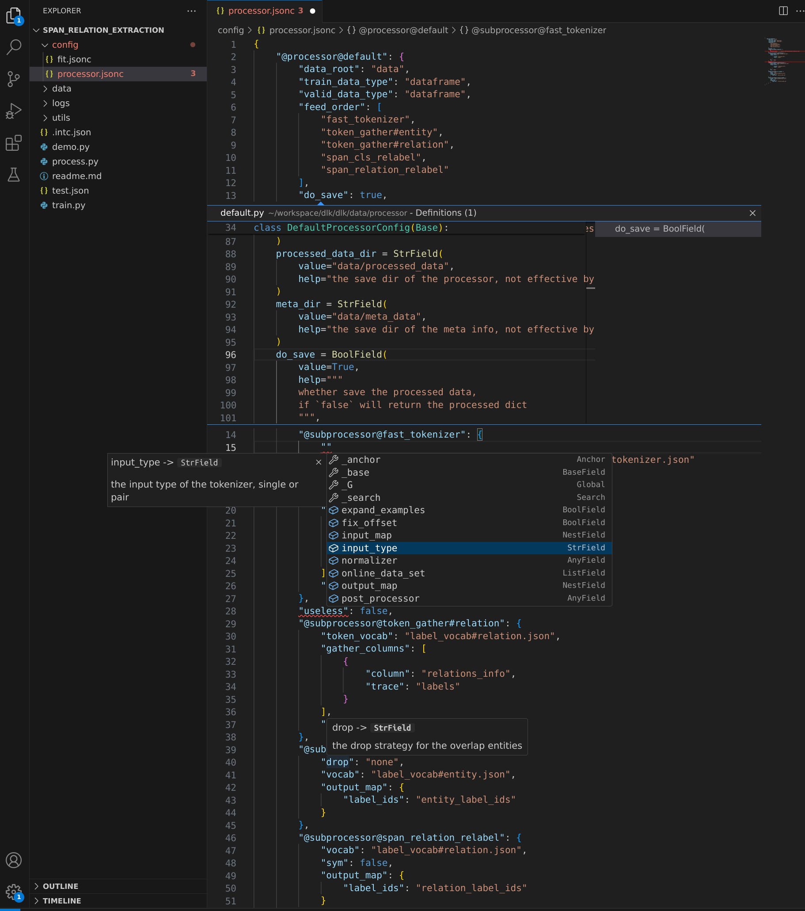
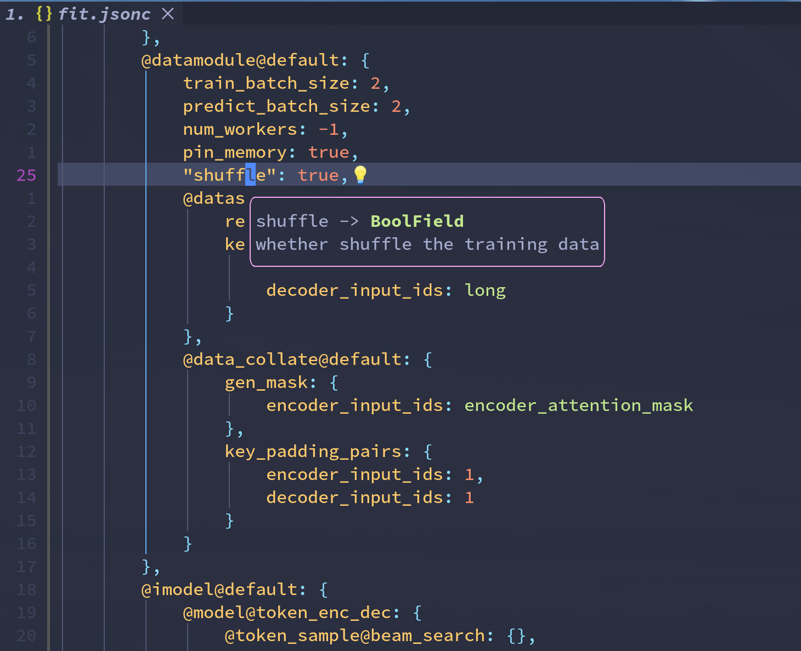
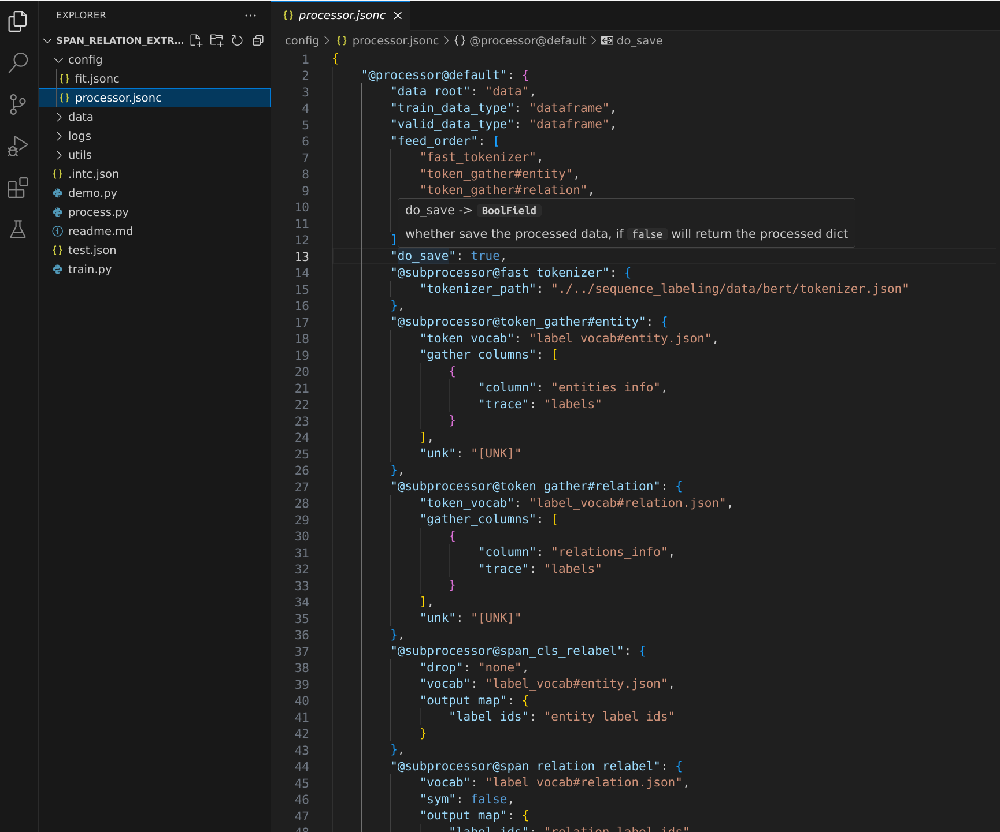
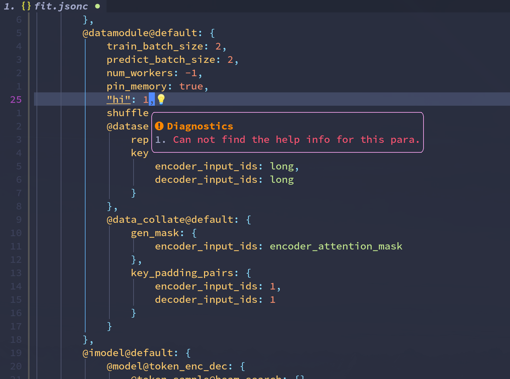
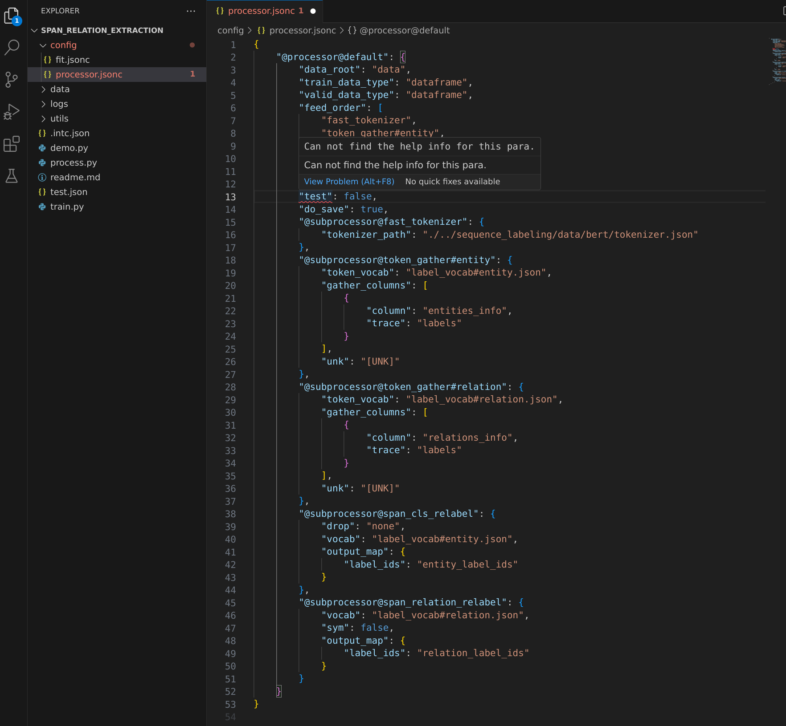
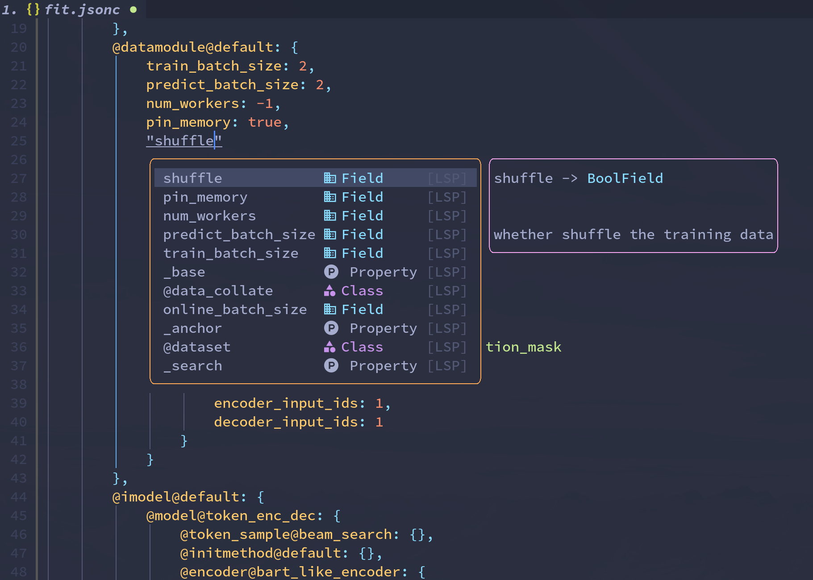
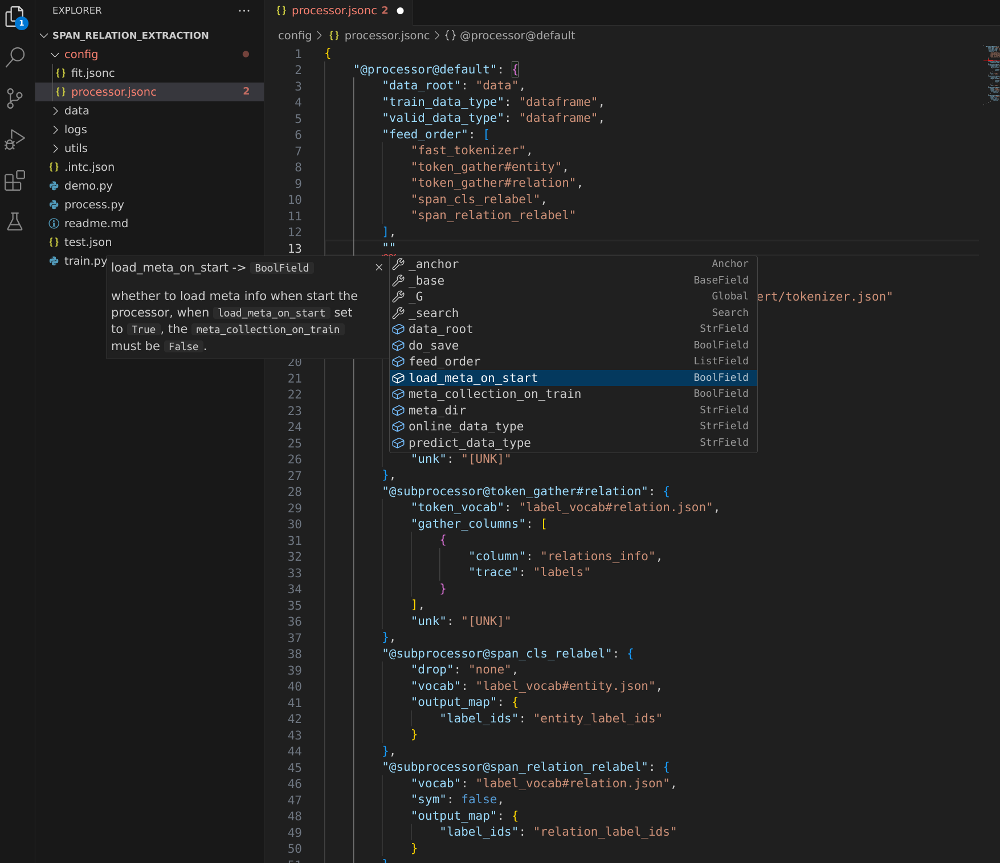
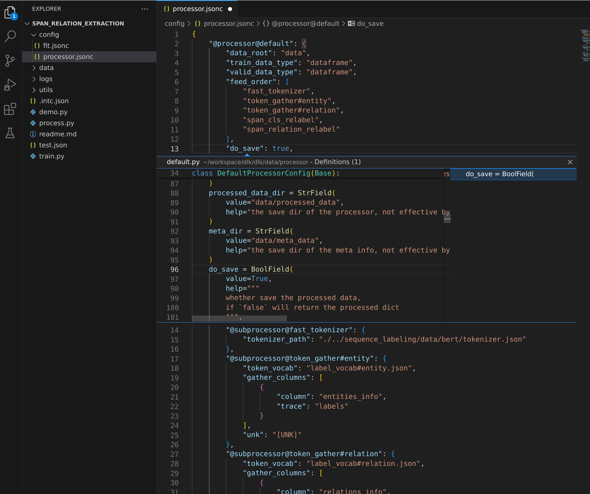

<p align="center">
  <h2 align="center"> Python Intelligence Config Manager</h2>
</p>

<p align="center">
A Python Config Manager for Humans
</p>


<div style="text-align:center">
<span style="width:70%;display:inline-block">



</div>

<h4 align="center">
    <p>
        <b>简体中文</b> |
        <a href="https://github.com/cstsunfu/dlk/blob/main/README_en.md">English</a>
    </p>
</h4>

* [安装](#安装)
* [Feature List](#feature-list)
* [Intc Use Case](#intc-use-case)
    * [参数引用及lambda语法](#参数引用及lambda语法)
    * [参数搜索](#参数搜索)
    * [DataClass && Json Schema](#dataclass-json-schema)
* [Intc-LSP](#intc-lsp)
    * [Hover Document](#hover-document)
    * [Diagnostic](#diagnostic)
    * [Completion](#completion)
    * [Goto/Peek Definition](#gotopeek-definition)


`intc`是一个功能强大的智能config配置管理工具，它不仅为我们的配置文件提供模块继承、模块嵌套、参数引用、超参搜索，还支持基于`lambda`表达式的复杂参数动态计算等功能。

而`intc`的配套Language Server Protocol（`intc-lsp`）则让我们的编辑浏览体验更加丝滑，它将配置文件与`python`代码紧密联合，`intc-lsp`可以帮助你在书写和阅读`intc`文件时方便的获取`python`的语义信息，提供错误提示、参数补全、智能跳转和参数帮助文档展示的功能。

除了用于`config`，`intc`还可以直接作为`dataclass`使用，它可以将我们使用`intc`定义的`dataclass`转化为`json schema`用于如`LLM`的数据类型约束，还可以对如`LLM`返回值在内的`json`数据进行数据检查并生成错误提示用于`LLM`的迭代优化。

### 安装

1. 准备`python`环境，要求`python>=3.8`，且目前只在`Linux`和`Mac`上面进行了测试，`Windows`的支持可能存在问题
2. 安装`intc`和`intc-lsp`，如果不需要使用智能补全等功能可以只安装`intc`

```bash
# install from pypi
pip install intc
pip install intc-lsp
```

或直接源码安装
```bash
cd intc/
pip install .
cd ../lsp
pip install .
```

3. 安装智能补全插件(Plugins)

`intc`提供了一个通用的Language Server Protocol（`LSP`），理论上只要你使用的编辑器或`IDE`支持`LSP`就可以使用，但是我平时主要使用`(neo)vim`，偶尔用一下`vscode`，因此目前只在这两种编辑器上做了适配

* neovim

`neovim`功能强大且易于扩展，社区已经对`LSP`提供了非常友好的支持，具体参考`plugins/neovim`

* vscode
  `vscode`也可以通过安装`intc-lsp`对应的插件来获取`lsp`的支持，具体参考 `plugins/vscode`

* 其他IDE与编辑器

  需要有相关经验的同学帮忙完善文档

### Feature List

下面是一些主要功能的简单介绍，具体用法可以跳转到对应的use case进行查看

* 模块继承
    * intc的python类之间可以和正常的python类一样进行继承
    * intc的config文件则是python类的实例化参数，同样可以看做是继承自Python类
    * 除此之外在一些复杂的config文件中config之间也可以存在继承关系.
* 模块嵌套，模块之间可以进行嵌套，一个更高级别的模块除了自己的参数之外还可以包含其他子模块，如在训练神经网络的任务中一个trainer除了自己的一些参数之外还可以包含model、optimizer和schedule等子模块
* 参数引用，一个参数可以依赖一个或多个其他参数的值，支持lambda动态计算参数的值
* 参数搜索，在很多任务中我们有多种参数组合，intc以笛卡尔积的形式展开所有的参数组合
* dataclass，作为dataclass可以直接作为某个模块的参数类、可以生成json schema、可以对参数进行检查

* config帮助文档，intc-lsp提供参数hover提示，当指针放到参数上时展示参数的帮助文档
* config错误提示，intc-lsp检查你的参数填写是否正确
* config参数补全，intc-lsp在你编辑config文件时进行语义补全
* config参数跳转，intc-lsp为你在浏览或编辑config文件时提供`goto/peek definition` python源码提供支持

* etc.

### Intc Use Case

我们将以`intc/examples/exp1`中的例子开始来介绍intc的基本用法

样例结构：

```
├── config                         -- config文件，目前支持json和jsonc文件，需要在.intc.json中指定config所在目录
│   ├── model.json
│   └── model_search.jsonc
├── .intc.json                     -- intc需要的meta数据
├── run.py                         -- your own code
└── src                            -- your project
    └── __init__.py
```

和一个普通的python项目相比，intc项目需要一个`.intc.json` 文件来描述项目的一些`meta`数据, 下面是这个exp中的配置:

```.intc.json
{
    // "module": ["config/module"],  // submodule所在目录, 相对于当前目录, 这个exp中没有submodule
    "entry": ["config"],                 // config所在目录, 相对于当前目录
    "src": [                           // config文件中用到的python模块，需要可以直接通过python import
        "src"
    ]
}

```

而使用intc的python代码则与dataclass非常相似，相比于python自带的dataclass提供了如数值检查、模型注册、生成json schema等功能

```python
from intc import (
    MISSING,            # MISSING是一个常量(在intc中的值为`???`)表示参数缺失，需要在实例化config时提供
    Base,               # 所有的intc dataclass 都继承该类（可以隐式继承）
    BoolField,          # 这些bool field
    DictField,          # dict field
    FloatField,         # ...
    IntField,
    AnyField,
    ListField,
    NestField,          # 嵌套field，相比dict可以提供更多的类型检查、智能补全等功能
    StrField,
    SubModule,
    cregister,          # cregister注册intc实例(支持二级命名, <module_type, module_name> )，用于实例的索引（通过<module_type, module_name>直接获取对应的model类，config中也会使用注册名来定位对应的model类
)


@cregister("model", "simple_cls")  # cregister将Model注册为intc类，`module_type`为`model`, `module_name`为`simple_cls`
class Model(Base):                 # 显式继承自Base，这里也可以不显式继承，register过程会自动执行这个过程，显式的继承可以提供更好的语义补全
    embedding_combine_method = StrField( # dataclass的属性定义
        value="concat",                  # 默认值
        options=["concat", "concat_linear"], # options 表示值必须是这几个里面的一个
        help="the combine method, just `concat` or use `linear` on the concated embedding",
    )
    embedding_size = IntField(
        value=MISSING, help="the sum of bert and glove embedding size" # 这里的default value为MISSING，需要在实例化时提供
    )
    active = StrField(
        value="relu",
        options=["relu", "tanh", "sigmoid", "none"],
        help="the activation function",
    )
    submodule = SubModule(   # 子模型，可以嵌套其他模型的定义，这里的子模型可以有多个，引用子模型需要用到这些子模型的注册名
        value={},
        suggestions=[        # suggestions 表示推荐的一些值, 对于代码阅读和intc-lsp的语义解析有帮助
            "embedding",
            "decode",
        ],
        help="submodules for basic model",
    )

@cregister("embedding", "bert")
class BertEmbedding:
    hidden_size = IntField(
        value=MISSING,
        minimum=1,
        help="the input/output/hidden size for bert, must >= 1",
    )
    dropout_rate = FloatField(
        value=0.0, minimum=0.0, maximum=1.0, help="the dropout rate for bert"  #
    )
....
```
实际开发过程中，我们往往使用config文件对业务逻辑进行配置，而json(及其衍生格式，如jsonc)非常适合用来编辑配置文件，`intc`配合`intc-lsp`对此提供了非常好的支持, 下面是针对已有的dataclass进行配置的例子:

```jsonc
// 文件 config/model.jsonc
{
    "@model@simple_cls": {  // 表明是对谁进行配置，格式为@module_type@module_name @model@simple_cls 对应被注册为这个名称的`Model`
        "active": "none",
        "embedding_size": "@$.@glove.hidden_size, @$.@bert.hidden_size @lambda x, y: x+y", // 这里的值为动态的lambda计算的，喊一声 embedding_size的值为@embedding@glove.hidden_size和@embedding@bert.hidden_size 的和， 关于lambda的语法请看本说明里面关于lambda的介绍
        "@embedding@glove": { // submodule, submodule 同样以@module_type@module_name作为标识
            "hidden_size": 300,
            "vocab_size": 5000
        },
        "@embedding@bert": {
            "hidden_size": 768
        }
    }
}
```
```python
# 文件 main.py
import exp

```
#### 参数引用及lambda语法

我们经常会遇到如一个encode模块的输出和decode模块的输入的维度相同，在配置文件中我们希望这两个参数的值始终保持一致，intc支持一个参数是另一个参数的引用，这样我们只需要修改其中的一个参数另一个参数的值也同步被修改了。


有时我们的一个参数的值依赖于多个其他参数，如在一个多encode的模型中，decode模块的输入维度是所有encode模型输出的维度的和，针对这种复杂的引用，intc提供`lambda`支持复杂的动态值计算.

在介绍`lambda`表达式之前，我们先对参数的引用规则进行介绍：

我们以下面的config为例：
```json
{
    "@parent@p": {
        "para_p_a": "value_p_a"
        "@wang@lao": {
            "para_lao": "value_lao"
        },
        "@children@wang": {
            "_anchor": "cwang",
            "para_wang_a": "value_wang_a",
        },
        "@children@li": {
            "para_li_a": "value_li_a",
            "para_li_b": "..."
        },
        "para_p_b": "..."
    },
    "para_a": "value_a"
}
```

我们想要在计算`para_p_b`时引用其他位置的值:

朴素的方式：

* 如果我们想要引用`para_p_a`的值，`para_p_a`与当前位置处于同级，我们用`$`来表示同级，那`para_p_a`的值在`para_p_b`位置的引用应该写为`$.para_p_a`
* 如果我们想要引用`para_a`的值，`para_a`处于当前位置的上一级，我们用`$$`来表示上一个级别（相信聪明的你已经发现每多一个`$`则表示往上多回溯一个级别)，那`para_a`的值在`para_p_b`位置的引用应该写为`$$.para_a`
* 如果我们想要引用`para_li_a`的值，则我们可以发现`para_li_a`位于当前位置同级的`@children@li`的下一级，所以`para_li_a`的值在`para_p_b`位置的引用应该写为`$.@children@li.para_li_a`

简化表达：

由于作为模块名的如`@children@li`的表达往往很长，书写起来不方便，而往往我们仅需要这个模块名的前缀或后缀就能区分一个模块，因此上面的最后例子在`para_p_b`处引用`para_li_a`的值哈可以写为`$.@li.para_li_a`, 这里将`@children@li`简化成了`@li`而不带来歧义，需要注意的是这里的简化必须为原表达的前缀或后缀，且只能用于模块名（也就是说只能以`@`等特殊符号进行阶段），这么做是为了降低阅读难度，减少歧义的发生。

锚点：

而如果我们在`para_p_b`处想要引用`para_wang_a`的值，这里的路径同样要经过一个模块名`@children@wang`我们就不能使用上面的简化表达的技巧，这是因为无论我们选择前缀`@children`(`@children@li`的前缀)还是后缀`@wang`(`@wang@old`的前缀是`@wang`)都会产生歧义，那我们只能老老实实的写下全名了吗? 并非如此，intc为了让一些长距离的引用更加方便，还支持`全局锚点`来为远程依赖提供方便，在这个例子中，我们看到 `@children@wang`内部有一个`_anchor`关键词，我们可以在任意位置引用`_anchor`所在位置的值来引用它所在位置的同级元素，因此，在`para_p_b`处我们可以通过`cwang.value_wang_a`来引用`para_wang_a`的值。

需要注意的是`_anchor`可以有多个，但是不得出现同名`_anchor`每一个的值必须是全局唯一的, 因此不要在子模块中设置`_anchor`

值引用的语法：
intc的引用是通过`@lambda`表达式来实现的，引用规则为：
```
{
    "para1": "value1",
    "para2": "@lambda @$.para1"
}
```


`lambda`除了用于值引用以外，还可以用于非常复杂的情况，下面是intc支持的`lambda`语法类型及使用示例:

1. 通用语法

intc 的`lambda`最通用的语法是

```
@para_1, @para_2, ...@para_n  @lambda x1, x2, ...xn: use x1 to xn calc the value
|__________________________|  |________________________________________________|
             │                                     │
  这里是要传个lambda的参数         这里的lambda表达式遵循python的lambda语法规则
  与后面lambda表达式的参数         传入的参数就是前面对应的参数名
  一一对应<para_1 -> x1>..
  这里的每个para的表示遵循
  引用规则
```

```json
{
    "para1": 1,
    "para2": 2,
    "para3": "@$.para1, @$.para2 @lambda x, y: x+y"
}
```
这里的`para3`是一个需要`lambda`计算的值，计算结果为`para1`与`para2`的值和`3`

2. `lambda` 计算
有些时候我们单纯的只是想通过`lambda`来计算一个值，而不需要引用其他参数，那我们可以这么写：
```json
{
    "para1": "@lambda _: list(range(100))"
}
```

此时`para1`的值仍然是一个`lambda`表达式，但是这个表达式的输入参数是空的，这个表达式的值为`[0, 1, 2..., 98, 99]`

3. 通过lambda进行值引用

语法已在参数引用部分进行介绍


#### 参数搜索

在做实验时，我们需要验证多种参数的组合，`intc`为我们提供了参数grid search的能力，针对每个搜索条件以笛卡尔积的形式进行组合，返回一个config list

```jsonc
// data.json
{
    "para1": 1,
    "para2": 100,
    "@children":{
        "cpara1": 1000,
        "cpara2": "a",
        "_search": {
            "cpara1": "@lambda _: list(range(1000, 1003))"
        }
    },
    "_search": {
        "para1": [1, 2, 3],
        "para2": "@lambda _: [100, 200, 300]",
        "@children.cpara2": ['a', 'b', 'c']
    }
}

```

```python
import json
from intc import Parser
assert len(Parser(json.load(open('data.json')).parser())) == 81
```

如示例中所示，`intc`的参数搜索的值可以是一个`list`也可以是一个`lambda`表达式返回一个`list`，但是目前在`_search`中使用的`lambda`表达式目前只支持值计算，不可以引用其他的参数参与计算，有这个限制的原因是`_search`本身有可能改变config的结构，而引用必须在config结构固定时才可以。所以实际引用的计算是在`_search`生成固定的config之后发生

#### DataClass && Json Schema

`intc`除了可以作为config管理工具使用之外，也可以当做`dataclass`来使用，特别是`intc`除了支持一般的`json`数据的导入导出之外，还可以根据定义导出`json schema`，这对于一些特定的场景如约定大模型的输入输出格式时非常有用


```python
import json

from intc import MISSING, Base, IntField, NestField, StrField, dataclass


@dataclass
class LLMOutput(Base):
    """The output of the LLM model"""

    user_name = StrField(value=MISSING, help="Name of the person")

    class Info:
        age = IntField(value=MISSING, minimum=1, maximum=150, help="Age of the person")
        blood_type = StrField(
            value=MISSING, options=["A", "B", "AB", "O"], help="Blood type"
        )

    user_info = NestField(value=Info, help="User information")
    lines = IntField(value=MISSING, help="Number of lines in the output")
print(json.dumps(LLMOutput._json_schema(), indent=4))
```

Json Schema Output:
```json
{
    "properties": {
        "user_name": {
            "description": "Name of the person",
            "type": "string",
            "deprecated": false
        },
        "user_info": {
            "description": "User information",
            "type": "object",
            "properties": {
                "age": {
                    "description": "Age of the person",
                    "type": "integer",
                    "deprecated": false,
                    "minimum": 1,
                    "maximum": 150
                },
                "blood_type": {
                    "description": "Blood type",
                    "type": "string",
                    "enum": [
                        "A",
                        "B",
                        "AB",
                        "O"
                    ],
                    "deprecated": false
                }
            }
        }
    },
    "type": "object",
    "description": "The output of the LLM model",
    "$schema": "https://json-schema.org/draft/2020-12/schema"
}
```
### Intc-LSP
#### Hover Document

<div style="text-align:center">
<span style="width:47%;display:inline-block">



</span>
<span style="width:47%;display:inline-block">



</span>
</div>

#### Diagnostic

<div style="text-align:center">
<span style="width:47%;display:inline-block">



</span>
<span style="width:47%;display:inline-block">



</span>
</div>

#### Completion

<div style="text-align:center">
<span style="width:47%;display:inline-block">



</span>
<span style="width:47%;display:inline-block">



</span>
</div>

#### Goto/Peek Definition

<div style="text-align:center">
<span style="width:47%;display:inline-block">


</span>
<span style="width:47%;display:inline-block">



</span>
</div>
